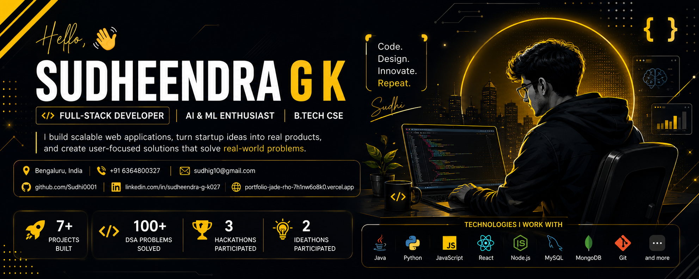
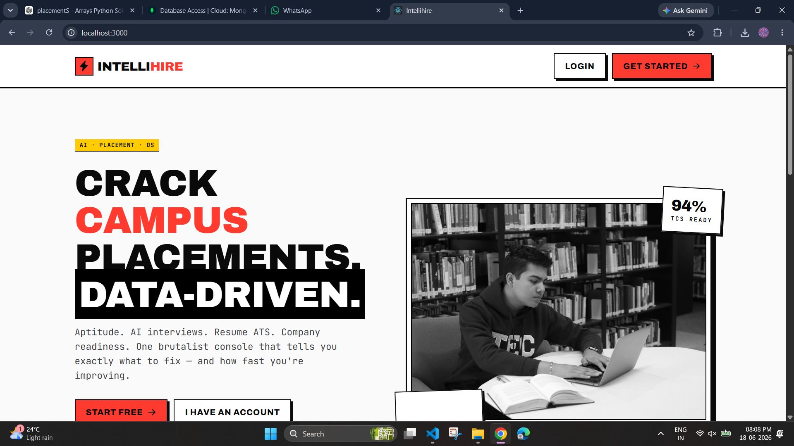
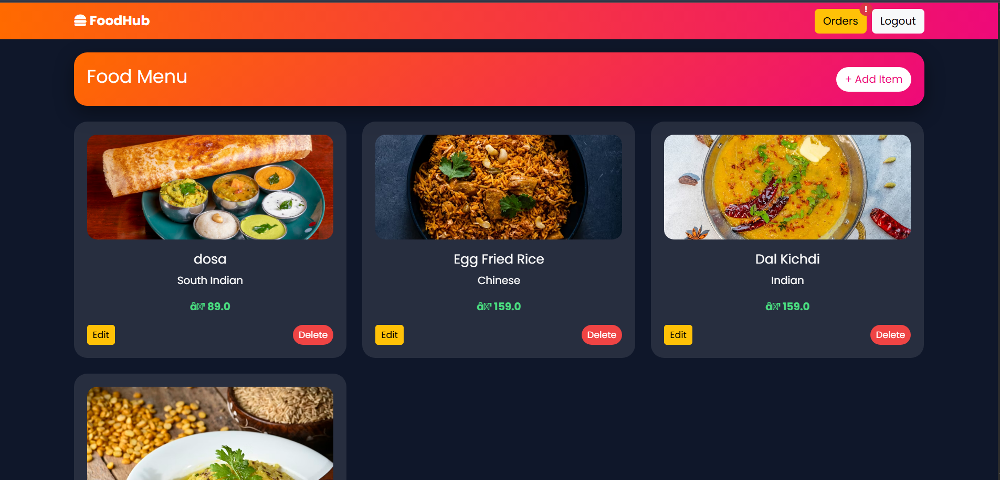
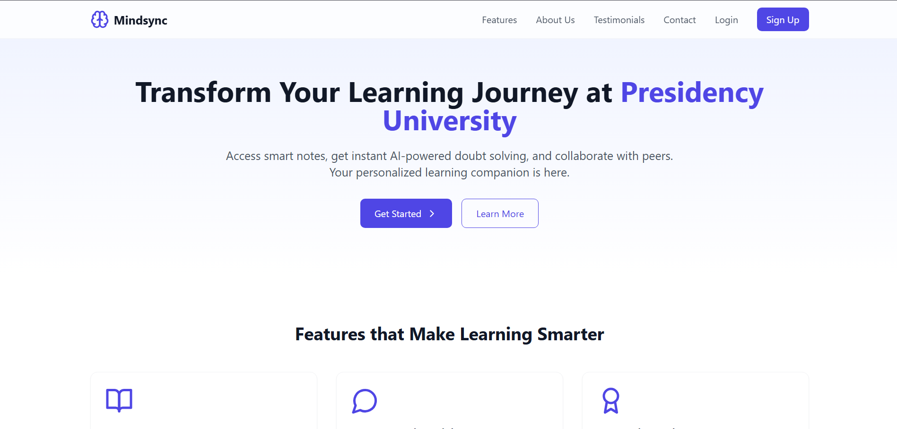
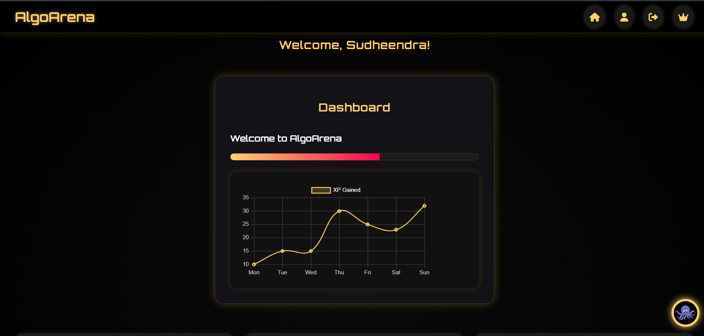
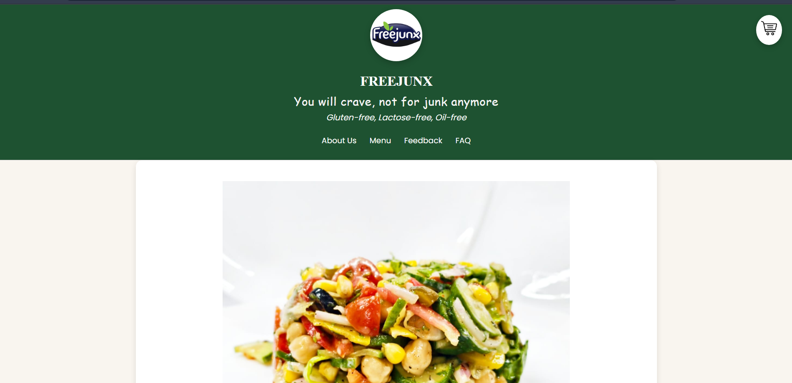
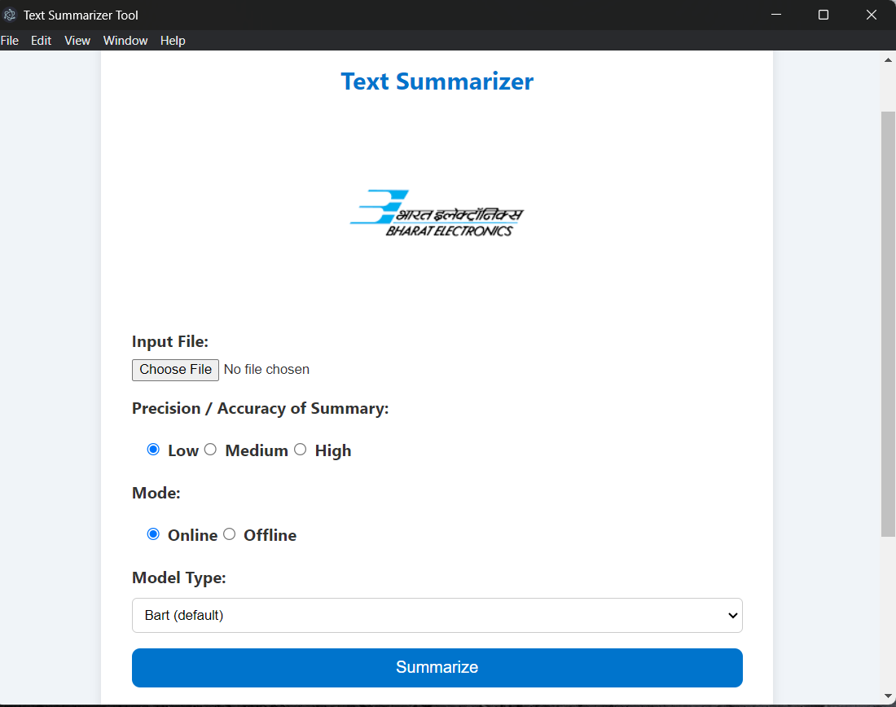

<!-- ====================================================== -->
<!--                  HERO SECTION                          -->
<!-- ====================================================== -->

<p align="center">



</p>

<h1 align="center">
Sudheendra G K
</h1>

<h3 align="center">

Software Engineer • Full-Stack Developer • AI Builder

</h3>

<p align="center">

<i>
Building software that solves real-world problems through engineering, design, and artificial intelligence.
</i>

</p>

<p align="center">

<a href="https://portfolio-jade-rho-7h1nw6o8k0.vercel.app">

</a>

<a href="https://github.com/Sudhi0001">

</a>

<a href="https://linkedin.com/in/sudheendra-g-k027">

</a>

<a href="mailto:sudhig10@gmail.com">

</a>

</p>

---

# 👋 Welcome

I’m **Sudheendra G K**, a Computer Science student and software developer passionate about building products that people actually use.

My focus goes beyond writing code—I enjoy solving meaningful problems through scalable software, intuitive user experiences, and modern engineering practices.

Whether it's an AI-powered recruitment platform, a food ordering system, a peer-learning ecosystem, or a startup website, I enjoy taking an idea from concept to deployment.

---
# 🧠 Engineering Mindset

> I believe great engineers aren't defined by how many technologies they know, but by how quickly they can learn, adapt, and deliver.

Whenever I identify a gap in my knowledge, I take ownership of closing it through research, hands-on practice, and real-world implementation.

I don't chase technologies—I learn whatever is required to build the best solution.


# 🚀 What I'm Building

<table>

<tr>

<td width="33%">

### 🤖 IntelliHire

AI-powered recruitment platform

Python • Flask • MongoDB

</td>

<td width="33%">

### 💻 AlgoArena

Competitive programming ecosystem

Learning • XP • Challenges

</td>

<td width="33%">

### 🎓 MindSync

Peer-to-peer learning platform

Mentorship • Community • Growth

</td>

</tr>

</table>

---

# 📊 Developer Snapshot

<p align="center">

| Projects | DSA | Hackathons | Ideathons | Internship |
|:--------:|:---:|:----------:|:----------:|:-----------:|
| **8+** | **100+** | **3** | **2** | **BEL** |

</p>

---

# 💡 What Drives Me

```text
✔ Building scalable web applications

✔ Turning startup ideas into real products

✔ Creating clean and intuitive user experiences

✔ Designing RESTful backend systems

✔ Writing maintainable, production-ready code

✔ Learning something new every single day
```

---

# ⚡ Tech Stack

## Languages

<p>


</p>

---

## Frontend

<p>


</p>

---

## Backend

<p>


</p>

---

## Databases

<p>


</p>

---

## Tools

<p>


</p>

---

# 📈 By the Numbers

<table>

<tr>

<td align="center">

## 🚀

### 8+

Projects

</td>

<td align="center">

## 💻

### 100+

DSA Problems

</td>

<td align="center">

## 🏆

### 3

Hackathons

</td>

<td align="center">

## 💡

### 2

Ideathons

</td>

</tr>

</table>

<!-- ====================================================== -->
<!--                 FEATURED PROJECTS                      -->
<!-- ====================================================== -->

<h1 align="center">

🚀 Featured Projects

</h1>

<p align="center">

The products I've designed, engineered, and deployed to solve real-world problems.

</p>

---

# 🤖 IntelliHire

### AI-Powered Recruitment Platform

<p align="center">



</p>

### Overview

Recruitment is often filled with repetitive manual tasks—from resume screening to interview scheduling.

**IntelliHire** automates these workflows using Artificial Intelligence, helping recruiters evaluate candidates faster and manage hiring more efficiently.

---

### Highlights

- 🤖 AI-assisted recruitment workflows
- 📄 Resume analysis
- 👥 Candidate management
- 📅 Interview scheduling
- 📊 Recruitment dashboard
- 🔐 Secure authentication
- 📡 RESTful APIs
- ⚡ Responsive interface

---

### Tech Stack

| Frontend | Backend | Database |
|-----------|-----------|-----------|
| HTML • CSS • JavaScript | Flask • Python | MongoDB |

---

<p align="center">

<a href="https://github.com/Sudhi0001/IntelliHire">

</a>

<a href="https://github.com/Sudhi0001/IntelliHire">

</a>

</p>

---

# 🍔 FoodHub

### Full Stack Food Ordering Platform

<p align="center">



</p>

### Overview

A complete enterprise food-ordering platform built using Java technologies following MVC architecture.

The system supports customers, administrators, order processing, authentication, and complete CRUD operations.

---

### Features

- 🍽️ Food Ordering
- 👤 Authentication
- 🛒 Cart
- 📦 Order Management
- ⚙️ Admin Dashboard
- 📊 SQL Database
- 🔐 Session Management

---

### Tech Stack

| Frontend | Backend | Database |
|-----------|-----------|-----------|
| HTML CSS JS | JSP Servlets JDBC | MySQL |

---

<p align="center">

<a href="https://github.com/Sudhi0001/FoodHub">


</a>

<a href="https://github.com/Sudhi0001/FoodHub">


</a>

</p>

---

# 🎓 MindSync

### Peer Learning Platform

<p align="center">



</p>

### Overview

MindSync is a collaborative peer-learning ecosystem that connects students with mentors, learning resources, and opportunities to grow together.

Instead of traditional classrooms, MindSync encourages community-driven learning.

---

### Features

- 👨‍🏫 Mentor Matching
- 📚 Resource Sharing
- 💬 Discussion Platform
- 🎯 Learning Dashboard
- 📈 Progress Tracking
- 🚀 Product Thinking

---

### Tech Stack

Product Design • Agile • UX Research

---

<p align="center">

<a href="https://github.com/Sudhi0001/MindSync">


</a>

<a href="https://github.com/Sudhi0001/MindSync">


</a>

</p>

---

# 💻 AlgoArena

### Competitive Programming Platform

<p align="center">



</p>

### Overview

AlgoArena transforms interview preparation into an engaging experience through gamification.

Rather than simply solving coding questions, users earn XP, unlock achievements, explore learning paths, and visualize algorithms.

---

### Features

- 🎮 XP System
- 🧠 Coding Challenges
- 📊 Analytics Dashboard
- 🎯 Mock Interviews
- 📚 Learning Resources
- ⚡ Algorithm Visualizer

---

### Tech Stack

HTML • CSS • JavaScript • Flask • MySQL

---

<p align="center">

<a href="https://sudhi0001.github.io/AlgoArena/">


</a>

<a href="https://github.com/Sudhi0001/AlgoArena">


</a>

</p>

---

# 🍟 FREEJUNX

### Production Marketing Website

<p align="center">



</p>

### Overview

A responsive marketing website delivered for a real startup.

The focus was creating an engaging experience while optimizing SEO, responsiveness, and conversions.

---

### Features

- 🌐 SEO Optimized
- 📱 Mobile First
- ⚡ Fast Performance
- 🎨 Modern UI
- 📈 Conversion Focused

---

### Tech Stack

HTML • CSS • JavaScript

---

<p align="center">

<a href="https://freejunx.in">


</a>

<a href="https://github.com/Sudhi0001/FREEJUNX">


</a>

</p>

---

# 🏢 Bharat Electronics Limited

### AI Text Summarization System

<p align="center">



</p>

### Internship Project

Developed an AI-powered document summarization system during my internship at Bharat Electronics Limited.

Focused on NLP workflows, document processing, backend integration, and evaluation pipelines.

---

### Responsibilities

- NLP
- Flask APIs
- Python
- Backend Integration
- Testing
- Debugging
- Deployment

<!-- ====================================================== -->
<!--              ENGINEERING JOURNEY                       -->
<!-- ====================================================== -->

<h1 align="center">

📈 Engineering Journey

</h1>

<p align="center">

Every project represents a problem solved, a lesson learned, and another step toward becoming a better software engineer.

</p>

---

## 🧑‍💻 My Engineering Philosophy

```text
I believe software isn't just about writing code.

It's about understanding people,
designing thoughtful solutions,
building reliable systems,
and continuously improving through iteration.

Every application I build begins with a problem,
not a programming language.
```

---

# 🏆 Career Highlights

<table>

<tr>

<td align="center">

# 🚀

### 8+

Applications Built

</td>

<td align="center">

# 💻

### 100+

DSA Problems

</td>

<td align="center">

# 🏢

BEL

Internship

</td>

</tr>

<tr>

<td align="center">

# 🏅

3

Hackathons

</td>

<td align="center">

# 💡

2

Ideathons

</td>

<td align="center">

# 🌍

Live Client

Projects

</td>

</tr>

</table>

---

# 🛠 Engineering Expertise

<table>

<tr>

<td width="50%">

## Backend

• REST APIs

• Authentication

• MVC Architecture

• CRUD Operations

• Session Management

• OOP

• API Integration

• Database Design

</td>

<td width="50%">

## Frontend

• Responsive UI

• User Experience

• Product Design

• Accessibility

• Performance

• SEO

• Animations

• Modern Interfaces

</td>

</tr>

</table>

---

# ⚡ Development Workflow

```text
Idea
 │
 ▼
Research
 │
 ▼
Wireframes
 │
 ▼
Development
 │
 ▼
Testing
 │
 ▼
Deployment
 │
 ▼
Continuous Improvement
```

---

# 🌱 Currently Learning

✔ Spring Boot

✔ React Ecosystem

✔ System Design

✔ Docker

✔ Cloud Deployment

✔ AI Applications

✔ Design Patterns

✔ Scalable Backend Architecture

---

# 🎯 2026 Goals

- ✅ Complete 300+ DSA Problems
- ✅ Contribute to Open Source
- ✅ Build SaaS Products
- ✅ Learn Kubernetes
- ✅ Master Spring Boot
- ✅ Land a Software Engineering Internship
- ✅ Publish Technical Articles
- ✅ Build AI-powered Applications

---

# 📊 GitHub Analytics

<p align="center">


</p>

---

<p align="center">


</p>

---

<p align="center">


</p>

---

<p align="center">


</p>

---

<p align="center">


</p>

---

# 📅 Project Timeline

```text
2025
│
├── Bharat Electronics Limited Internship
│
├── FREEJUNX
│
├── MindSync
│
├── AlgoArena
│
│
2026
│
├── IntelliHire
│
├── FoodHub
│
├── Radiant Bites
│
├── Carmania
│
└── Portfolio v2
```

---

# 🎖 Certifications

🏆 HackerRank — Problem Solving (Intermediate)

🏆 Bharat Electronics Limited Internship

🏆 Kerala Blockchain Academy

🏆 Python Programming — Scaler

🏆 Digital Forensics — Udemy

---

# 💬 Favorite Quote

> "Great software is built by understanding problems, not by chasing technologies."

---


<!-- ====================================================== -->
<!--                  OPEN SOURCE                           -->
<!-- ====================================================== -->

<h1 align="center">

🌍 Beyond the Code

</h1>

<p align="center">

I believe the best software is built through curiosity, collaboration, and continuous learning.

Every repository here represents more than code—it represents a challenge, an idea, and a step forward in my journey as an engineer.

</p>

---

# 🤝 Let's Build Something Together

I'm always interested in working on projects that involve:

<table>

<tr>

<td width="50%">

### 💼 Software Engineering

• Full Stack Applications

• Enterprise Solutions

• Backend Systems

• REST APIs

• AI Integration

</td>

<td width="50%">

### 🚀 Product Development

• Startup MVPs

• SaaS Platforms

• Automation Tools

• AI Products

• UI/UX Experiences

</td>

</tr>

</table>

---

# 📬 Connect With Me

<p align="center">

<a href="mailto:sudhig10@gmail.com">

</a>

<a href="https://portfolio-jade-rho-7h1nw6o8k0.vercel.app">

</a>

<a href="https://linkedin.com/in/sudheendra-g-k027">

</a>

<a href="https://github.com/Sudhi0001">

</a>

</p>

---

# 💬 A Few Things I Believe

```text
✔ Code should be simple before it's clever.

✔ Great products begin with understanding users.

✔ Consistency beats intensity.

✔ Every bug teaches something.

✔ Learning never stops.
```

---

# ⚡ Fun Facts

- ☕ Powered by coffee and curiosity.
- 🌙 I enjoy building late at night when ideas flow best.
- 🧩 I like turning complex problems into simple user experiences.
- 📚 Always exploring new technologies and design patterns.

---

# 📈 Visitor Counter

<p align="center">


</p>

---

# 🐍 Contribution Snake

<p align="center">


</p>

> **Note:** You'll generate this automatically using a GitHub Action once the profile repository is set up.

---

# 🌟 Thanks for Visiting

<p align="center">

If you've made it this far, thank you for taking the time to explore my work.

I'm always excited to collaborate, learn, and build software that creates real impact.

</p>

---

<h2 align="center">

Building products that matter.

</h2>

<p align="center">

⭐ If you enjoy my work, consider following my journey and exploring my repositories.

</p>


